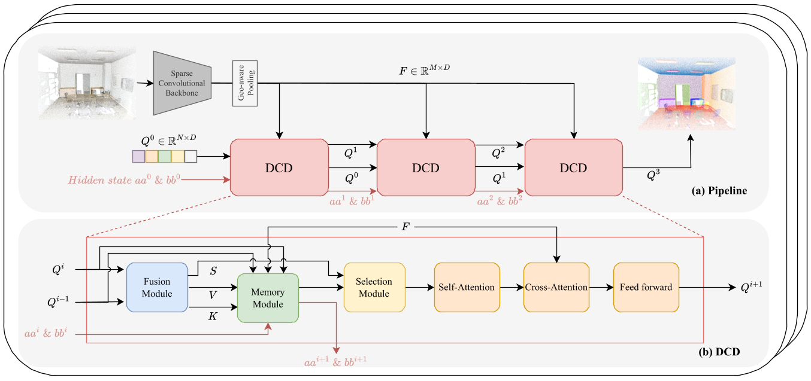

# Enhancing 3D Instance Segmentation with Dense Connection Decoder and Layer Aware Fusion (RAL2025)

**Duanchu Wang, Haoran Gong, and Di Wang**



This is the official implementation of paper "Enhancing 3D Instance Segmentation with Dense Connection Decoder and Layer-Aware Fusion".

## 🔥 Highlights

- **Dense Connection Decoder (DCD)**: A novel decoder architecture that leverages dense connections to enhance feature propagation and information flow.
- **Layer-Aware Fusion**: An innovative fusion strategy that adaptively combines multi-scale features from different layers.

## 📰 News
- **2025-08-19**: 🚀 Code and training configurations released!
- **2025-08-04**: 🎉 Our paper has been accepted by RAL 2025!

## 🛠️ Installation

### Requirements
- Python 3.8
- PyTorch 1.13.1
- CUDA 11.7

### Setup Environment
```bash
# Clone the repository
git clone https://github.com/yourusername/Enhancing-3D-Instance-Segmentation-with-Dense-Connection-Decoder-and-Layer-Aware-Fusion.git
cd Enhancing-3D-Instance-Segmentation-with-Dense-Connection-Decoder-and-Layer-Aware-Fusion

# Create conda environment
conda create -n dcd python=3.8
conda activate dcd

# install attention_rpe_ops
cd lib/attention_rpe_ops && python3 setup.py install && cd ../../

# install pointgroup_ops
cd dcd/lib && python3 setup.py develop && cd ../../

# install dcd
python3 setup.py develop

# install other dependencies
pip install -r requirements.txt
```

## 📊 Dataset Preparation

### ScanNet Dataset
Please follow the instructions in `data/scannetv2/` to prepare the ScanNet dataset:

```bash
cd data/scannetv2
bash prepare_data.sh
```

### Data Processing
Process the dataset for training:
```bash
python data/scannetv2/prepare_data_inst.py
python data/scannetv2/prepare_data_inst_with_normal.py
python data/scannetv2/prepare_data_inst_gttxt.py
```

## 🎯 Training

### Training Configuration
The training configuration is available in `configs/scannet/dcd_scannet.yaml`. Modify the parameters as needed.

### Start Training
```bash
python tools/train.py configs/scannet/dcd_scannet.yaml
```

## 🧪 Evaluation

### Test on ScanNet
```bash
python3 tools/train.py configs/scannet/dcd_scannet.yaml --resume [MODEL_PATH] --eval_only
```

## 📈 Results

### ScanNet Dataset Val

| Method | AP | AP50 | AP25 |
|--------|----|----- |------|
| Ours   | 61.2 | 78.6 | 85.0 |

### ScanNet Dataset Test

| Method | AP | AP50 | AP25 |
|--------|----|----- |------|
| Ours   | 61.4 | 79.8 | 88.5 |

## 🏗️ Model Architecture

Our method consists of:
1. **Backbone Network**: Sparse convolution-based feature extraction
2. **Dense Connection Decoder (DCD)**: Multi-scale feature fusion with dense connections
3. **Layer-Aware Fusion**: Adaptive feature combination across different layers
4. **Instance Head**: Final instance segmentation prediction

## 📝 TODO
- [x] 📦 Installation instructions
- [x] 🗃️ Processing datasets
- [x] ⚙️ Release training configs
- [x] 💻 Release training code
- [x] 🔗 [Backbone pretrained weights](https://drive.google.com/file/d/1ac7BMZkt3FNge3JpWcXSgi98CzGqdgJ9/view?usp=drive_link)
- [ ] 🚀 Release trained weights and experiment record

## 🙏 Acknowledgments

We thank the following repositories for their valuable contributions:

- [**EmbodiedSAM**](https://github.com/xuxw98/ESAM): For inspiring online 3D instance segmentation approaches and efficient real-time processing techniques.
- [**Mask-Attention-Free-Transformer**](https://github.com/dvlab-research/Mask-Attention-Free-Transformer): For providing insights on mask attention-free transformer architectures and efficient feature processing methods.

## 📄 Citation

If you find this work useful for your research, please cite:
```bibtex
@article{wang2025enhancing,
  title={Enhancing 3D Instance Segmentation with Dense Connection Decoder and Layer-Aware Fusion}, 
  author={Wang, Duanchu and Gong, Haoran and Wang, Di},
  journal={IEEE Robotics and Automation Letters}, 
  year={2025},
  doi={10.1109/LRA.2025.3600142},
}
```

## 📧 Contact

For questions and suggestions, please contact:
- Duanchu Wang: [wangduanchu@stu.xidian.edu.cn]

## 📜 License

This project is released under the [MIT License](LICENSE).
